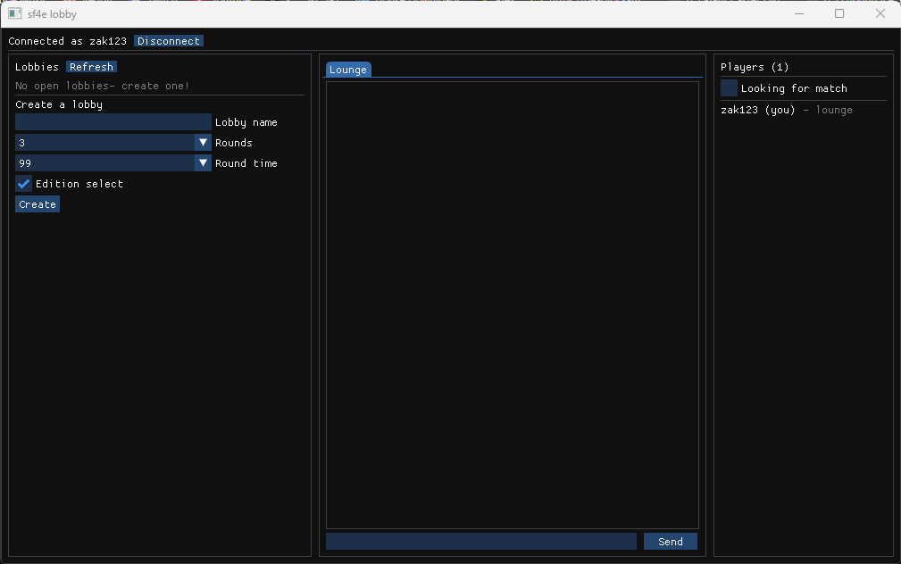

# SF4 Rollback GUI

Rollback netcode and online lobbies for _Ultra Street Fighter IV_ on Steam.

## What is this?

[sf4e](https://codeberg.org/adanducci/sf4e) by adanducci injects GGPO
rollback netcode (instant inputs, lag hidden by prediction) into USF4 at
runtime, without modifying any game files. This fork adds the online
experience around it, similar to Fightcade: a desktop app with chat and
a lobby browser, dedicated servers, and matches that launch the game
directly.

## Status

Early playtest. Lobbies, chat, and launch-into-match work; the current
goal is validating real internet matches. No rankings, spectating, or
score tracking yet — rematch freely, nothing is recorded.

## Join the playtest

You need [USF4 on Steam](https://store.steampowered.com/app/45760/)
(installed) and Windows 10+.

1. Download `sf4-rollback-gui-client.zip` from the
   [latest release](https://github.com/zak123/sf4-rollback-gui/releases/latest)
   and extract everything into one folder.
2. Run `LobbyClient.exe`, pick a name, and connect to
   `sf4.zak123.com:23450`.
3. Create or join a lobby, pick your character (P1 also picks the
   stage), and hit **Ready**. The game launches on its own.
4. At the title screen, press a button on the controller you want to
   play with. The match starts by itself.
5. Rematch by readying up again in-game. Close the game to return to
   the lobby app.

**If matches keep failing after ~45 seconds:** forward UDP port 23457
on your router. Two players on the same network usually can't play each
other.

**Bugs:** open an issue with the logs from `%APPDATA%\sf4e\logs` and a
video clip if you can.

## Developers

- [Building from source](docs/building.md)
- [Architecture and roadmap](docs/product-design.md)
- [Hosting a lobby server](docs/vps-playtest.md)
- `scripts/local-test.bat` — local server plus two apps for development

Changes to the rollback core itself are better aimed at
[upstream sf4e](https://codeberg.org/adanducci/sf4e).

## Credits and license

Built on [sf4e](https://codeberg.org/adanducci/sf4e) by
[adanducci](https://codeberg.org/adanducci). Uses
[GGPO](https://github.com/pond3r/ggpo),
[GameNetworkingSockets](https://github.com/ValveSoftware/GameNetworkingSockets),
[Dear ImGui](https://github.com/ocornut/imgui),
[spdlog](https://github.com/gabime/spdlog),
[nlohmann/json](https://github.com/nlohmann/json),
[Detours](https://github.com/microsoft/Detours), and
[ValveFileVDF](https://github.com/TinyTinni/ValveFileVDF).

MIT licensed — see [LICENSE](LICENSE). Street Fighter and Ultra Street
Fighter IV are © CAPCOM. Not affiliated with or endorsed by Capcom;
requires your own legitimately purchased copy of the game.
