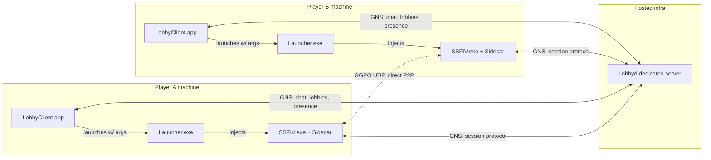

# sf4e Product Design: Lobby Service + Desktop Client

Status: DRAFT for review · Scope: 1v1 · Last updated: 2026-07-17

## 1. Vision

A Fightcade-style experience for Ultra Street Fighter 4 on Steam: users open a
desktop app, pick a nickname, chat in a lounge, browse open 1v1 lobbies, join
one, and the game launches directly into a rollback match. No IP addresses, no
manual port typing, no in-game menu spelunking.

**Division of labor:** the rollback implementation (Dimps RE layer, memento
save states, GGPO integration) stays with upstream (adanducci). This fork
builds the product shell around it: lobby infrastructure, chat, the client app,
packaging, and releases. Game-side patches are kept minimal and upstreamable.

### Goals (v1)

- Dedicated, headless lobby server (`Lobbyd`) hostable on a VPS.
- Desktop client (`LobbyClient`): nickname, lounge chat, lobby list,
  create/join lobby, per-lobby chat, launch-into-match.
- 1v1 lobbies only (2 players). No spectators in v1.
- Direct-IP GGPO with optional UPnP port mapping. Relay comes later.

### Non-goals (v1)

- King-of-the-hill / winner-stays lobbies. **Note:** the server's
  `HandleResults` already rotates the loser to the back of the member list, so
  KOTH later is mostly capacity + UI work, not a redesign.
- Accounts, rankings, elo, persistence. Nicknames are per-session.
- In-game character select screen for netplay (v1 keeps selection in the
  client app; the game continues to use the existing skip-to-versus flow).
- Spectators, replays, matchmaking queues, region filters.
- Linux-native `Lobbyd` build (target it for M4; GNS and the Session code are
  portable in principle, but `windows.h` usage needs cleanup first).

## 2. Current architecture (what we build on)

Verified against commit `d236425`:

- `Session` static lib is game-independent: JSON messages over
  GameNetworkingSockets; references only plain data types from `Dimps`
  (`FixedPoint`, `ConfirmedCharaConditions`). `SessionInteractiveTest.exe`
  already runs the full client+server stack in a plain desktop app.
- The in-game integration surface is three callbacks (`OnReady`,
  `OnBattleSynced`, `OnError`) plus `UserApp::StartSession/StartServer` and the
  GGPO handoff reading `members[0..1]` ip:port from lobby data.
- Handshake today: GNS connect → client sends `hello` → server assigns
  ephemeral CID → client **auto-sends** `join_req` (sidecar hash, name, GGPO
  port) → server seats it in its single lobby → `data_update` broadcast.
- One lobby per server process, ID hardcoded `{identity, "1"}`. The "null
  lobby" concept and `LobbyID` type exist (upstream groundwork) but there is no
  create/list/browse, and no chat.
- The session server currently runs *inside the host player's game process*.
- GGPO is effectively stock 2019 upstream + build packaging; it uses its own
  UDP sockets, so GNS NAT traversal does not cover match traffic.

## 3. Target architecture



Both games are pure `SessionClient`s against the dedicated server (no more
in-game `StartServer`). The client app holds a *presence* connection for chat
and lobby browsing that persists through the match.

### Components

| Component | Kind | Source | Links |
|---|---|---|---|
| `Lobbyd` | new console exe | `src/lobbyd/` | Session, GNS, spdlog, json |
| `LobbyClient` | new WIN32 exe | `src/client/` | Session, GNS, imgui, d3d9, spdlog, json |
| `Launcher` | modified | `src/launcher/` | + join-args plumbing |
| `Sidecar`/`sf4e` | minimally modified | `src/sf4e/` | + auto-join on main menu |
| `Session` | extended | `src/session/` | + chat/lobby/handoff messages |

`LobbyClient` starts life as a fork of `interactive_test.cxx` (ImGui + D3D9 +
GNS skeleton already works). It needs its own static character/stage roster
tables — the `Dimps::characterNames`/`stageNames` tables are pointers into
*game memory* and do not exist outside the game process.

## 4. Protocol changes

All new messages are JSON like the existing ones. New `MessageType` entries are
appended, never reordered (the enum serializes to strings, so renumbering is
safe upstream-wise, but string names are the contract).

### 4.1 Registration vs. lobby join (splitting today's conflation)

Today `join_req` both registers the user and seats them in the lobby. Product
flow separates these:

- `join_req` **without** a `lobby` field: register to the server, land in the
  null lobby (lounge). Backward compatible with upstream behavior when the
  server has a default lobby configured (`Lobbyd` will not).
- `join_req` **with** `lobby: {host, key}` (+ optional `handoff` token): seat
  the sender in that lobby.

### 4.2 New messages

| Type string | Direction | Payload | Purpose |
|---|---|---|---|
| `chat_send` | C→S | `channel` (`"lounge"` or lobby key), `text` | Post a chat line |
| `chat_event` | S→C | `channel`, `from` (name), `text`, `ts` | Broadcast chat line |
| `lobby_create` | C→S | `name`, `roundCount`, `roundTime`, `editionSelect` | Create a 1v1 lobby, creator auto-seated P1 |
| `lobby_create_resp` | S→C | `result`, `lobby` (LobbyID) | Ack with assigned ID |
| `lobby_list` | C→S | *(empty)* | Request open-lobby snapshot |
| `lobby_list_resp` | S→C | `[{id, name, playerCount, state, players[]}]` | Browse data |
| `lobby_leave` | C→S | *(empty)* | Return to lounge |
| `match_handoff` | S→C | `token`, `lobby` | Issued to the app when both players ready; passed to the game for seat transfer |

Server-side rules: rate-limit `chat_send` (e.g. 5 msgs / 2 s per connection),
cap `text` length (256), sanitize to printable UTF-8. Lobby list only includes
lobbies in `WAITING` state.

### 4.3 Seat handoff (app → game)

The app's presence connection occupies the lobby seat while browsing/chatting.
When both players are seated and the match starts, the game process must take
over the seat (it is a *different* GNS connection, and today would be rejected
as `name_taken`):

1. Server sends each seated app a `match_handoff` with a one-shot token
   (random 128-bit, 60 s TTL).
2. App launches `Launcher.exe` with server address, lobby ID, name, token,
   GGPO port, delay.
3. In-game client sends `join_req` with `lobby` + `handoff`; server swaps the
   seat's connection to the game connection (same name, no dup rejection).
4. The app's presence connection stays in the lounge for chat; seat now
   belongs to the game. On game disconnect, seat frees and lobby returns to
   `WAITING` or closes.

### 4.4 Versioning

`join_req` already carries the sidecar hash (enforces identical builds — this
becomes our release-channel enforcement for free). Add `protocolVersion` (int)
so `Lobbyd` can serve mismatched-but-compatible clients a clean error instead
of silent weirdness.

## 5. Match flow (end to end)

```mermaid
sequenceDiagram
    participant A as App (P1)
    participant S as Lobbyd
    participant B as App (P2)
    participant GA as Game (P1)
    participant GB as Game (P2)
    A->>S: lobby_create
    S-->>A: lobby_create_resp + data_update
    B->>S: lobby_list / join_req{lobby}
    S-->>B: data_update (seated P2)
    A->>S: prebattle_setchara / setstage / setenv, lobby_ready
    B->>S: prebattle_setchara, lobby_ready
    S-->>A: match_handoff{token}
    S-->>B: match_handoff{token}
    A->>GA: launch Launcher.exe --join ...
    B->>GB: launch Launcher.exe --join ...
    GA->>S: join_req{lobby, handoff}
    GB->>S: join_req{lobby, handoff}
    S-->>GA: data_update (both seats = games)
    S-->>GB: data_update
    Note over GA,GB: existing flow: lobby_allready → OnReady →<br/>skip-to-versus → battle_loaded → battle_synced
    GA<->>GB: GGPO UDP (direct / UPnP-mapped)
```

v1 keeps the current model where character/stage/settings are chosen **before**
the game launches (in the app UI, replacing the in-game overlay dropdowns).
The game boots straight into the fight via the existing `bSkipToVersus` path.
Post-match v1: report result (auto-detection is an M3 game-layer patch),
games exit or idle, seats return to the apps, lobby resets to `WAITING`.

## 6. Game-side changes (kept minimal, upstreamable)

1. **Launcher args** (`launcher.cxx` + `sf4e.hxx`): extend `Args` (it already
   flows through the Detours payload — fixed-size struct, so fixed `char[]`
   buffers): `bAutoJoin`, `szServerAddr[64]`, `szLobbyKey[64]`,
   `szHandoffToken[64]`, `szName[32]`, `nGgpoPort`, `nDelay`, `nDeviceHint`.
2. **Auto-join** (`sf4e__UserApp.cxx` / `sf4e__GameEvents.cxx`): when
   `bAutoJoin` and the main menu becomes foreground, call `StartSession(...)`
   with the payload args instead of waiting for overlay input. Keep the
   overlay's manual flow untouched as the fallback/dev path.
3. **Device capture**: v1 keeps the existing in-game "press a button" capture
   prompt before ready-up (shown by the overlay Network window when auto-join
   is active). Pre-selecting the device from the app is a later nicety.
4. **Auto result detection** (M3): hook end-of-match state to send
   `lobby_reportresults` without the manual button. This is the largest
   game-layer patch; design it with upstream if possible.

## 7. Fork & upstream strategy

- Branch `productize` off upstream `main`; merge upstream regularly.
- New code lives in new dirs/targets (`src/lobbyd/`, `src/client/`) — zero
  upstream conflict surface.
- `src/session/` protocol extensions are the conflict-prone area (all of
  upstream's 2025 activity is here). Mitigations: append-only message types,
  new logic in new files where possible (`sf4e__LobbyRegistry.{h,c}xx` for
  multi-lobby state rather than rewriting `SessionServer`), and open a
  conversation with adanducci early — chat/browse/multi-lobby is visibly where
  upstream is already heading (null lobby, LobbyID, forwarding, cluster
  identity routing).
- Sidecar hash gating means our releases and upstream's builds can't
  cross-play. That's fine — it's the version-enforcement mechanism.
- Add `.claude/` and `/vcpkg_installed` to `.gitignore` in the first commit.

## 8. Milestones

- **M1 — Dedicated server + client on localhost.** `Lobbyd` target (headless,
  multi-lobby registry, chat, list/create/join/leave, handoff tokens);
  `LobbyClient` target (connect, nickname, lounge chat, lobby list,
  create/join, lobby chat, ready UI with chara/stage pickers). Game launch
  still manual (overlay) — protocol proven end-to-end without touching the
  game.
- **M2 — Launch-into-match.** Launcher args + payload plumbing + auto-join +
  seat handoff. Full app-to-fight flow on LAN. This is the "it feels like
  Fightcade" moment.
- **M3 — Play loop polish.** Auto result detection, post-match return to
  lobby/rematch, disconnect handling (seat frees, lobby survives), first-run
  setup (game path detection reuse, nickname persistence in a config file).
- **M4 — Public alpha.** UPnP mapping for the GGPO port (miniupnpc), hosted
  `Lobbyd` on a VPS, packaged zip release with versioned update check, basic
  server abuse controls (rate limits, connection caps).
- **M5 — Later.** KOTH lobbies (capacity > 2 + queue UI — server rotation
  already exists), spectators (blocked on upstream issue #10), accounts +
  rankings, UDP relay fallback for symmetric NATs, Linux `Lobbyd`.

## 9. Presence, challenges, and quickmatch (researched 2026-07-18)

Two requested features, designed but not yet built: a list of online
players with click-to-challenge, and a "looking for match" toggle that
pairs players automatically. Both are protocol + server + app work with
**zero game-side changes** — the game only ever sees "I've been seated
in a lobby and it went all-ready," exactly as today. (Prior art check:
Confetti3's "Find match" is an HTTP room browser on their broker; they
have no persistent client connections, so neither presence nor pairing
exists there. Our always-connected apps make both cheap.)

### Prerequisite: unlisted lobbies

`Lobby` gains `bool unlisted`; `lobby_list` skips unlisted lobbies.
Challenge and quickmatch lobbies are created unlisted so a third party
can't grab a seat meant for a specific pair. Not exposed in the create
UI for now.

### Presence

| Message | Direction | Payload |
|---|---|---|
| `presence_list` | C→S | *(empty)* |
| `presence_list_resp` | S→C | `players: [{name, status}]`, `lookingCount` |

Status is derived server-side, deduping the app/game connections that
share a name: `in_match` if any same-name connection sits in a lobby
whose match cycle is live, else `in_lobby` if seated, else `looking`
if flagged for quickmatch, else `lounge`. The app polls on the same 2s
tick as `lobby_list` and renders a Players tab beside the chat.

### Private challenges

| Message | Direction | Payload |
|---|---|---|
| `challenge_send` | C→S | `target` (name) |
| `challenge_event` | S→C (target) | `from` |
| `challenge_answer` | C→S | `from`, `accept` |
| `challenge_result` | S→C (challenger) | `target`, `result: accepted/declined/expired/busy/offline` |

Rules: both sides must be idle in the lounge; one outstanding
challenge per sender; 30s expiry; disconnects resolve as `offline`;
simultaneous cross-challenges resolve first-processed-wins, the other
gets `busy`. On accept the server creates an unlisted lobby with the
server-default match settings and **seats both connections** — the
apps' existing lobby-panel behavior takes over from there, and the
normal pick/ready/handoff flow runs unchanged.

UI: clicking a player in the Players tab offers Challenge (enabled
only when both are in the lounge); an incoming challenge renders as an
actionable banner with Accept/Decline.

### Quickmatch ("looking for match")

| Message | Direction | Payload |
|---|---|---|
| `matchmake` | C→S | `enabled` |
| `matchmake_event` | S→C (both) | `opponent` |

The server keeps a FIFO queue (flag + timestamp on the peer; lounge
peers only). After each message-processing step, while two or more
queued peers exist, it pairs the two oldest into an unlisted "Quick
match" lobby with server-default settings, clears their flags, and
emits `matchmake_event` so the apps can toast "Matched with X." Players
still pick characters and ready up — quickmatch removes *finding* an
opponent, not confirming the fight. Toggling off, joining anything
else, accepting a challenge, or disconnecting leaves the queue.

### Coverage and effort

All of it is exercisable by the headless smoke test (presence statuses,
challenge accept/decline/expiry/busy, unlisted exclusion from listings,
FIFO pairing, queue-clearing interactions). Estimated effort: presence
~half a day, challenges ~a day, quickmatch ~half a day.

### Open decisions

1. Challenge/quickmatch lobby settings: server defaults (proposed) or
   challenger's saved preferences once the app has config persistence?
2. Should quickmatch eventually auto-ready with remembered characters?
   (Proposed: later, after the app persists a main.)
3. Players list placement: tab in the chat pane (proposed) vs. an
   always-visible third column.

## 10. NAT traversal plan (researched 2026-07-19)

Lobbyd already *is* the signaling server — both players hold
connections to it and it can relay coordination messages. Three
mechanics ride on top, adapted from Confetti3's MIT-licensed
implementation (`NatProbe`, `TryCoordinatedP2pPunch`,
`ggpo_udp_relay`) onto our session channel:

1. **Endpoint discovery (STUN-alike).** A tiny UDP echo service beside
   Lobbyd; each game probes it *from its GGPO socket* pre-match and
   reports its true public `ip:port` through the session, replacing
   today's session-IP + self-reported-local-port guess.
2. **Coordinated punch.** New `punch_ready`/`punch_go` messages relayed
   between the seated game connections; both sides fire packets at each
   other's public *and private* endpoints simultaneously from the GGPO
   port (private fixes the same-router hairpin case), then GGPO starts
   on that port and inherits the opened mappings. Succeeds on
   cone/port-restricted NATs — most home routers.
3. **UDP relay fallback (TURN-alike).** For symmetric NAT/CGNAT pairs:
   the server pairs two flows under a token and forwards datagrams;
   GGPO is pointed at the relay instead of the peer. ~10–15 KB/s per
   player, negligible on the VPS. A ~3s punch-verification exchange
   before GGPO starts picks direct vs. relay invisibly.

Sequencing: ship 1+2 first (1–2 days; probe and coordination are
smoke-testable, real-NAT success needs the playtest), measure the
connect rate, then decide the relay's urgency (another 1–2 days).
Nothing touches the rollback core — GGPO just gets better addresses.

## 11. Open questions

1. **Branding/naming** — `Lobbyd`/`LobbyClient` are working names; product
   name TBD before public alpha.
2. **Hosting** — who pays for / operates the VPS; single region to start?
3. **Upstream relationship** — propose protocol extensions upstream first, or
   ship in fork and offer later? (Recommend: open an issue/discussion with
   adanducci once M1 works, with the protocol doc attached.)
4. **Chat moderation** — v1 ships nickname + rate limit only; anything more
   needs identity, which is deliberately out of scope.
